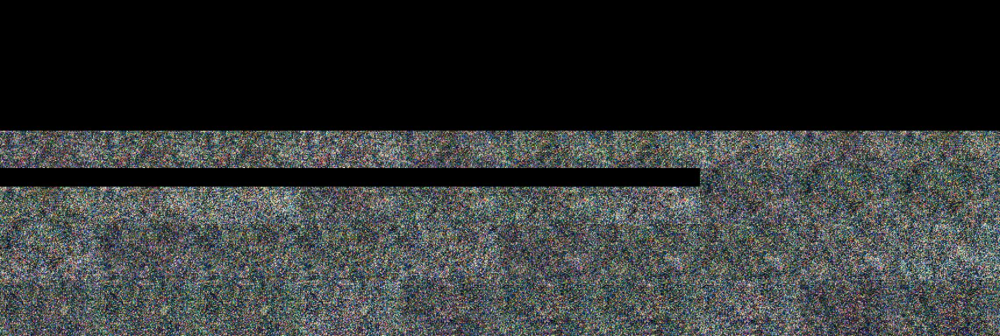
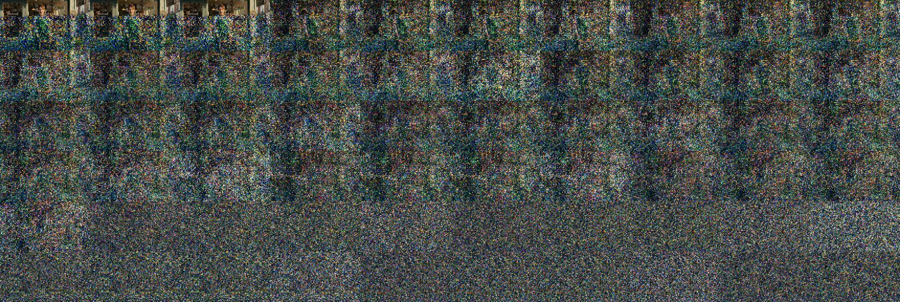

# 官方 FastH3 补测：fastvideo-frame-limit-01

**两次完整生成尝试已结束，成功交付 0/2。** 时长对齐补丁使官方入口接受目标规格，
两次 CLI 均生成原生 MP4 并返回 0，但交付适配器在原片时长检查处失败；随后逐帧缩略图
检查发现两条视频约 10 秒后的画面损坏。因此，本轮没有可进入速度表的完整交付成绩。

2026-09-10 UTC，Apple M5 Max / 128 GiB / macOS 26.6.1。按 motion graphics、bakery
顺序串行执行，每项一次，均为已见公共输入。权威数据见 [results.json](results.json)，
[CSV](results.csv) 区分空的成功耗时与失败尝试成本，原始运行记录保持不变。

| 输入 | CLI 原片 | 最终交付 | 成功耗时 | 失败尝试成本 |
| --- | --- | --- | ---: | ---: |
| motion graphics / 2026 | 已生成 | 失败 | — | 2 小时 4 分 19 秒 |
| bakery / 87001 | 已生成 | 失败 | — | 1 小时 49 分 56 秒 |

失败尝试成本为启动新进程至校验失败，精确值为 7458.8329740839545 和
6595.964420999866 秒；它们不是成功交付时间，不用于速度排名或提速倍率。

## 固定问题与配置

问题是：仅修复官方时长对齐检查后，能否完成两条固定公共 768p / 15 秒声画交付。
事前方案、停止条件及 SHA 已纳入 JSON。交付要求为 **1366×768、360 帧、15 秒、
24fps、32 kHz 立体声**；模型实际生成 **1376×768 / 362 帧**，交付只居中裁切、截尾。

官方源码基点 `a943220c115228ade5d57b3bab9a6a87fd600a10`，本地对齐补丁提交
`17825c79c4d839d03f3907769f6b19cc982ca5d4`，标签为
**Official FastH3 / VSA + frame-limit fix**。补丁与安装证据见
[补丁说明](../../patches/README.md)。比较控制器提交为 `87f2d95`。

使用官方 `mlx_fasth3.py`：四步，VSA sparsity 0.9、tile 64、prefix exempt、impl auto，
关闭 fast / fast-spatial，完整 FP32 H3 VideoVAE。日志确认实际是 **reference VSA**，
两次各 200 次 attention、200 次稀疏调用、零 fallback，实际稀疏率约 0.899551。
入口未直接报告 NFE，原始 `actual_nfe` 保持空值，不由配置步数代填。

复用与 Ours 相同有效载荷的本地 native-FL2VA + 官方 rank64 VSA adapter 转换；
这不是下载完整 student snapshot 后的等价性结论。没有新模型下载或参数搜索。
新进程、空提示词缓存；保留普通系统与 Metal cache，等待 nominal / 接电起跑的时间另记。

## 两个独立失败现象

**原片时长边界。** 两条 MP4 都有 362 帧，视频时长 15.083333 秒，AAC 音频
15.072000 秒，音视频从零开始。音频比模型帧数对应的时长短约 **11.333 ms**，但仍
覆盖目标 15 秒。当前 `finish_native` 调用只允许正向 AAC 尾部填充的校验，因此在
裁切、截尾之前拒绝原片；没有生成最终 `output.mp4`。本轮未放宽校验或重封装，
原始失败不被追认为通过。

**后段画面损坏。** 完整音视频码流解码均返回 0，但这不代表图像内容正常。
motion graphics 后段先有黑屏、再有彩色噪点；固定 blackdetect 阈值检出
9.916667–10.833333 秒黑段。bakery 约 10 秒后出现大面积彩色噪点，延续至尾帧；
相同阈值未检出黑段。以下均为原片第 240–299 帧的顺序缩略图（10.000–12.458 秒）：

motion graphics 日志在解码像素转 uint8 时报告 `invalid value encountered in cast`；
bakery 日志没有这项警告。未保留浮点中间张量，尚不能把起因归到 DiT、VSA、VAE
或对齐补丁。修复音频边界也不会修复这些画面。这里是 Agent 的诊断观察，正式用户
完整声画接受仍为 `pending`；本轮不构成盲评或总体质量结论。

## 官方阶段计时，仅供定位成本

| 阶段（秒） | motion graphics | bakery |
| --- | ---: | ---: |
| 条件编码 | 18.00 | 9.36 |
| 去噪 | 6791.93 | 5937.42 |
| 其中 DiT forward | 6791.69 | 5937.13 |
| 视频解码 | 636.06 | 638.48 |
| 音频解码 | 1.24 | 1.17 |
| 官方封装 | 2.41 | 2.22 |
| 官方原生生成总计 | 7449.65 | 6588.65 |

以上来自失败尝试的官方日志，未包含成功的最终交付校验。去噪占原生生成时间约
90–91%。去噪阶段 MLX 峰值分别为 40.11 / 39.70 GiB，视频解码阶段均为 22.34 GiB；
它们不是进程或整机峰值。完整精度计时、VSA 统计和分阶段内存值保存在 JSON。

## 核验与处理决定

结束后重新核对官方干净提交、实际解释器、30 个运行文件、依赖清单、媒体工具，以及
已做准备哈希的模型凭据与 35 个文件的大小/mtime；均与两次起跑身份一致。所有原始
结果、配置、日志、媒体及诊断文件记录 SHA256。资源采样没有 swap 增长，温度只有
nominal / fair，始终接电且低电量模式关闭；未触发停止条件。两条子进程退出 0，
比较控制器退出 1，设备锁已重新取得并释放。

本轮完成后停止自动补跑。Ours 的运行核心、交付校验和模型保持原样；没有因失败
改选 attention 配方或修改上下游数值计算。若以后需要完成这条官方对照，应先定位
后段坏图，并单独处理 AAC 原片校验边界，再使用新目录重测。

日常提速仍以 Ours 稳定版和候选的配对实验为主。Ours / vpipe 的既有成功等待时间
见 [native-three-02](../native-three-02/README.md)；本轮没有重跑它们，也没有新的
成功官方成绩可用于计算倍率。

原片和大日志保留在本机 `.local/comparisons/fastvideo-frame-limit-01/`，
事前方案、完整媒体元数据、顺序诊断图和前后身份核验在
`.local/validation/fastvideo-frame-limit-e2e-01/`。JSON 中 `$PRODUCT`、`$MODELS`
代表本机路径角色；原片未作为公开下载附件发布。

## 后续核对：为什么 P084 B 曾经成功

用户指出历史速度图中的 P084 B 已能成片。核对后，P084 B 的 `Original MLX` 指相对
P084 C 的旧 MLX 后端；其入口已包含本地时长处理和 mere 稀疏内核，不是未经修改的
官方 CLI。两条路径的实际区别和本次算子复现见 [核对证据](diagnostics/p084-context.json)。

| 项目 | P084 B 长片 | 本轮官方补测 |
| --- | --- | --- |
| 原生生成规格 | 1024×576 / 362 帧 | 1376×768 / 362 帧 |
| 稀疏实现 | SIMD 路径接入本地 mere 内核 | 官方 auto 实际选择 reference |
| MLX / mlx-metal | 0.32.0，原 macOS 14 后端 | 0.32.2，macOS 26 后端 |
| 时长处理 | 既有 runner 放行模型对齐余量，再截尾并严格验收最终交付 | 仅补入口对齐，原片 AAC 预检仍拒绝 |

历史 P091 首次 768p 长片也曾在约 10 秒后坏图，已有大张量 SwiGLU 索引修复。
本次使用当前官方环境复现同一精确值算子：576p 的 64,391×28,672 规模全部正确；
768p 的 113,183×28,672 规模在采样行 74,899 起把应为 1024 的结果算成 0。
后者包含 3,245,182,976 个元素，越过有符号 32 位索引范围；既有分块激活在相同
大形状的全部输出上精确得到 1024。两项检查均未加载模型或重新生成视频。

这证明当前官方环境仍有同类算子缺陷，为本轮后段坏图提供了强线索；没有完成这轮
中间张量对照或修复后的完整生成，尚不认定它是全部坏图的唯一原因。原始两次失败
保持不变。正式长跑前应复用已有的形状边界检查，本轮预检漏掉了这一项。
