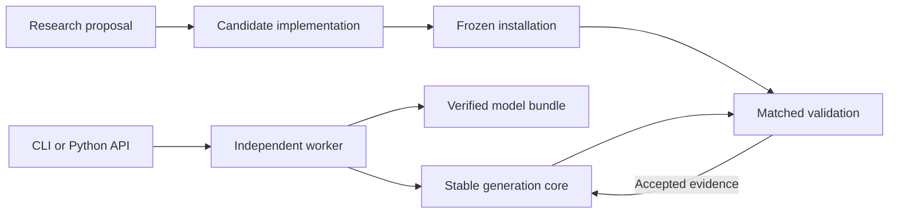

# Architecture

The product has one goal: reduce the wait for an H3 video while retaining
accepted output quality. Everyday users call one generation API. Research
compares an Ours candidate with the stable recipe; vpipe is an optional external
reference when that comparison needs updating.

## Ownership

| Layer | Responsibility |
| --- | --- |
| `api.py` / `cli.py` | User parameters, request resolution, results, and progress |
| `process.py` / `worker.py` | Worker lifecycle, cancellation, timeouts, and device ownership |
| `runtime/` | The supported generation recipe and Apple GPU optimizations |
| `_vendor/` | Narrow, attributed upstream code required by the runtime |
| Assets, preparation, and conversion | Pinned sources, download/reuse, verified conversion, and bundle identity |
| `benchmarks/compare.py` | Optional Ours/vpipe execution, common delivery rules, timing, and evidence |
| Research repository | Proposals, ablations, diagnostics, qualification, and adoption decisions |

The caller validates a request and starts a worker. The worker owns the device
lock through model loading, generation, full decoding, and delivery validation.
The comparison controller holds the same lock for vpipe. Cancellation ends the
process group and preserves failure evidence.

Model preparation is separate from generation. Source revisions and hashes
are fixed; reusable files are verified before conversion. Converter identity,
rounding behavior, quantization, and backend selection are recorded in the
bundle. Generation uses that immutable bundle and runs offline.

## Keep the product small

A generic backend registry, permanent HTTP service, and third shared repository
are unnecessary for the current API. The product contains the stable Ours path
and optional Ours/vpipe benchmark adapters. Current comparisons cover 5-second
and 15-second videos; official FastH3 remains in historical evidence only.

Research changes enter through a candidate branch and a frozen installation.
Adoption requires relevant correctness checks, matched generation evidence,
and the appropriate quality review. Accepted changes can then merge into the
product without exposing proposal-specific knobs to ordinary users.

See [API](api.md), [models](models.md), and the [development workflow](development.md).
The research repository's `docs/h3-apple-architecture.md` retains the original
architecture proposal; this document describes the current product.
