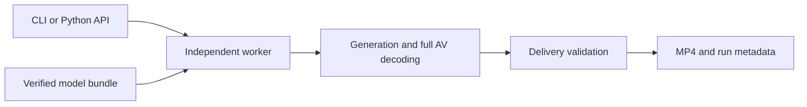

# Architecture

H3 Apple exposes one CLI and Python API for text-to-video generation with audio.
Model preparation and optional Ours/vpipe benchmarking are separate from the
generation path.

## Ownership

| Layer | Responsibility |
| --- | --- |
| `api.py` / `cli.py` | User parameters, request resolution, results, and progress |
| `process.py` / `worker.py` | Worker lifecycle, cancellation, timeouts, and device ownership |
| `runtime/` | The supported generation recipe and Apple GPU optimizations |
| `_vendor/` | Narrow, attributed upstream code required by the runtime |
| Assets, preparation, and conversion | Pinned sources, download/reuse, verified conversion, and bundle identity |
| `benchmarks/compare.py` | Optional Ours/vpipe execution, common delivery rules, timing, and evidence |

The caller validates a request and starts a worker. The worker owns the device
lock through model loading, generation, full decoding, and delivery validation.
The comparison controller holds the same lock for vpipe. Cancellation ends the
process group and preserves failure evidence.

Model preparation is separate from generation. Source revisions and hashes
are fixed; reusable files are verified before conversion. Converter identity,
rounding behavior, quantization, and backend selection are recorded in the
bundle. Generation uses that immutable bundle and runs offline.

See [API](api.md), [models](models.md), and the [development workflow](development.md).
