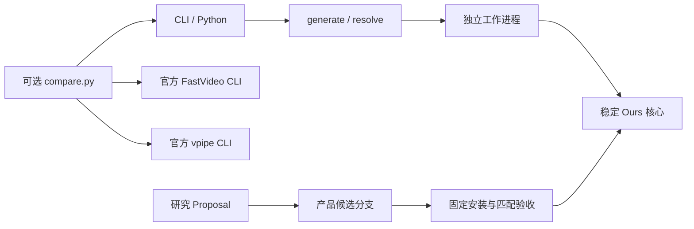

# 产品架构

目标是让用户容易生成完整声画视频，并持续缩短同规格、可接受质量下的等待时间。
日常 API 只服务 Ours；三个入口的比较是独立可选脚本。

| 所有者 | 职责 |
| --- | --- |
| `api.py` / `cli.py` | 请求、交付规格、参数验证和进度；公共导入不加载 MLX |
| `process.py` / `worker.py` | 新进程、取消、设备锁、资源保护与无覆盖发布 |
| `runtime/` | NAX sparse、SwiGLU、VAE 与唯一稳定生成编排 |
| `_vendor/fastvideo_mlx/` | 带来源和修改声明的必要上游计算子集 |
| `assets.py` / `preparation.py` / `conversion.py` | 内容身份、本机复用、固定下载和隔离转换 |
| `benchmarks/compare.py` | 直接调用三条现有 CLI，统一输入、外层计时和最终媒体检查 |
| 研究仓库 | Proposal、匹配实验、消融、原始证据、质量判断和未采用候选 |

生成请求先解析为用户规格与模型规格。默认生成 1376×768 / 362 帧，再居中裁切并
截取为 1366×768 / 360 帧；24fps 与立体声音频固定。每次工作进程持有设备锁，父
进程负责生命周期与发布。外部官方进程则由比较脚本持锁，避免重复获取同一把锁。

模型源按固定 revision 和内容 SHA 复用；转换与生成使用同一 Conda 环境中的独立
进程，转换阶段明确固定缓存舍入所需的后端设置。生成恢复物理 M5 架构。成功产物
只有视频和小型运行记录；研究诊断通过按需 observer 导出。

无需通用后端接口、插件注册表、常驻 HTTP 服务或额外共享核心仓库。三方主表只有
Ours、官方 FastH3/VSA、vpipe/VDN；日常研究通常只配对产品候选与稳定版本。

请求契约见 [API](api.md)，源与派生资产身份见 [模型准备](models.md)，后续优化进入
稳定版的方式见 [研究协作](development.md)。本文件维护当前结构；研究仓库中
`docs/h3-apple-architecture.md` 保留最初设计快照。
